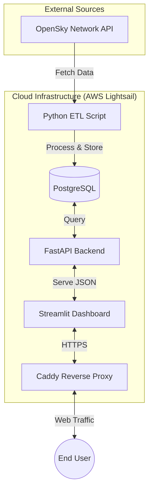
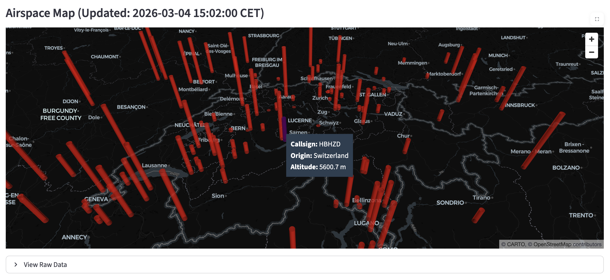

# ✈️ Swiss Airspace Tracker

[](https://opensource.org/licenses/MIT)
[](https://www.python.org/)
[](https://github.com/pmax42/swiss-airspace-tracker/actions)

**Live Demo:** [https://maximepetre.com](https://maximepetre.com)

## 📖 About The Project

The *Swiss Airspace Tracker* is a full-stack, real-time data engineering and visualization project. It monitors active flights over Switzerland using the OpenSky Network API, processes the telemetry data, and displays it on an interactive 3D map.

This project was designed to showcase a complete end-to-end data pipeline: from ingestion (ETL) and storage to backend API serving and frontend visualization, all orchestrated with Docker and automated via CI/CD.

### 🏗️ Architecture



### ✨ Key Features

* **Real-Time ETL Pipeline:** Fetches and processes flight data every 60 seconds. Optimizes storage by maintaining only a rolling 2-hour window of historical data.
* **Interactive 3D Map:** Built with Streamlit and PyDeck to render a dynamic, auto-refreshing map of live air traffic.
* **Decoupled Architecture:** Separated into distinct microservices for data ingestion, database, REST API, and frontend.
* **Automated Deployment:** CI/CD pipeline using GitHub Actions for continuous deployment to AWS Lightsail on every push to the `main` branch.

### 📸 Preview



## 🚧 Technical Challenges & Solutions

During development and production deployment, several major architectural challenges were addressed:

1. **Bypassing AWS IP Blocks by OpenSky:**
   * *Problem:* When deploying to AWS Lightsail, the OpenSky API systematically blocked requests originating from AWS datacenter IP addresses.
   * *Solution:* I implemented an external proxy integration within the ETL script (configured via environment variables) to seamlessly route traffic and successfully fetch data in production.

2. **Performance Optimization on Safari (WebKit) via HTTPS:**
   * *Problem:* Severe loading and rendering delays were observed on the Safari browser over HTTP, due to WebKit's specific handling of unsecure traffic.
   * *Solution:* I set up a reverse proxy using **Caddy** to automatically secure the application with HTTPS. This immediately resolved the WebKit performance issues while securing access to the dashboard.

3. **Separation of Environments (Development / Production):**
   * *Problem:* The complex production environment (including Caddy and AWS specificities) was slowing down the local development cycle.
   * *Solution:* I created two distinct architectures. The development environment relies on a dedicated `docker-compose.local.yml` file (ignored by Git) that directly exposes ports and facilitates hot reloading, while `docker-compose.yml` is strictly reserved and optimized for production.

## 🛠️ Tech Stack

* **Data Engineering & Backend:** Python, Pandas, FastAPI, SQLAlchemy
* **Database:** PostgreSQL (Alpine)
* **Frontend:** Streamlit, PyDeck, Streamlit-AutoRefresh
* **DevOps & Infrastructure:** Docker, Docker Compose, Caddy, GitHub Actions, AWS Lightsail

## 🚀 Getting Started Locally

To run this project on your local machine, you will need Docker and Docker Compose installed.

1. Clone the repository:

   ```bash
   git clone https://github.com/pmax42/swiss-airspace-tracker.git
   cd swiss-airspace-tracker
   ```

2. Create a `.env` file in the root directory based on `.env.example` file.

3. Spin up the development environment:

   ```bash
   docker-compose -f docker-compose.local.yml up -d --build
   ```

4. Access the services:
   * **Dashboard:** http://localhost:8501
   * **API Docs (Swagger):** http://localhost:8000/docs

---

*Developed by Maxime P.*
